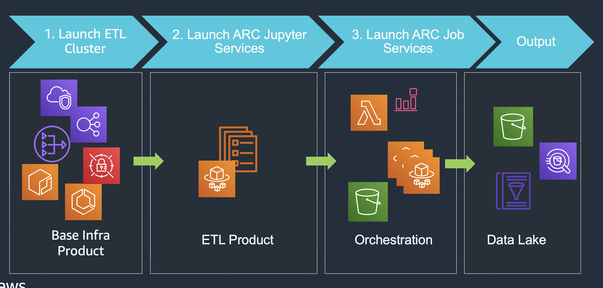

# Self Service ETL Reference Architecture

This reference architecture creates an AWS Service Catalog Portfolio called "Self-service ETL Reference Architecture"  
The Portfolio provides 3 products which will create a full DevOps deployment pipeline from code to ETL pipeline deployment in serverless Fargate.  

### Create the portfolio using the Launchstack with default settings: 
  

1. Once finished, go to [Service Catalog](https://ap-southeast-2.console.aws.amazon.com/servicecatalog/) in your AWS console.
2. Click your login dropdown box, choose [Switch Role](https://signin.aws.amazon.com/switchrole)
3. Input your AWS AccountID, and `ServiceCatalogEndusers` as your Role
4. Launch the product `1-ETL Cluster` with default. Wait until the provision is done. Please ignore a warning message 'A stack name already exists', proceed with the new name given by the system.
5. Launch the product `2-Arc Jupyter Service` with default parameters, except `DataLakeS3Bucket`. Replace it by an existing S3 bucket in your AWS account. Make sure the S3 bucket is in the same region as the product you launched. Wait until the provision is done. 
6. Open the notebook URL produced by your Jupyter service. Upload the sample Arc ETL job [SCD Type2 Workshop](app-code/job/) and run each stage of the job.
6. Finally, launch the product `3-Arc Job Service`  and wait until the provision is done. 
7. Follow the instruction in the Jupyter notebook, download it then upload to an S3 bucket `jobtrigger-xxx`. It will trigger an Arc job execution, based on the file drop event.

### Clean up
1. Empty out your jobtrigger S3 Bucket as administrator.
2. Remove products in reverse order from Service Catalog or cloudformation console. Terminate Fargate task (job trigger) -> Jupyter Notebook Fargate Service -> ETL Fargate Cluster -> SC-RA-ECS-Portfolio

### ETL Framework Reference

[online document](https://arc.tripl.ai/extract/)

