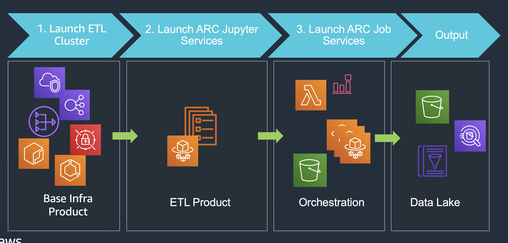
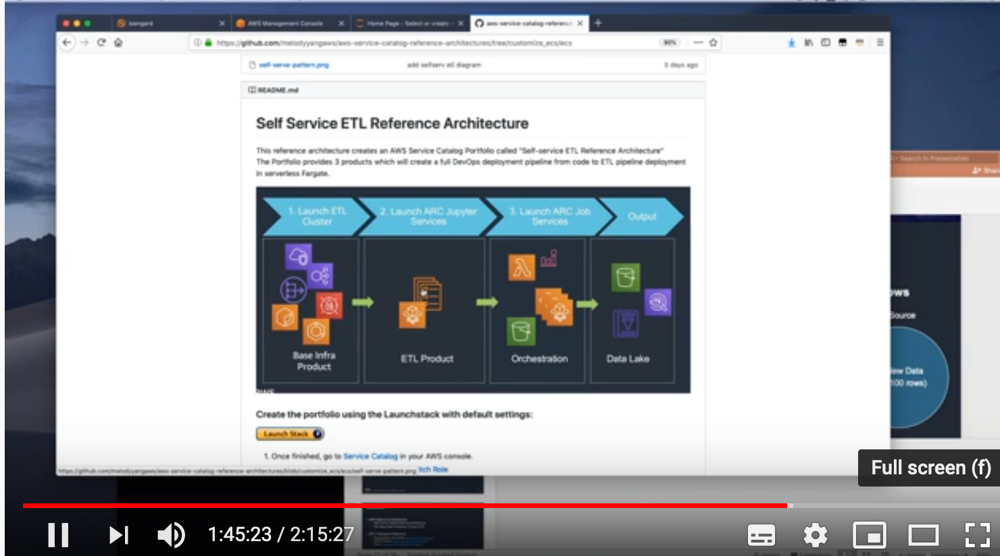

# Self Service ETL Reference Architecture

This reference architecture creates an AWS Service Catalog Portfolio called "Self-service ETL Reference Architecture"  
The Portfolio provides 3 products which will create a full DevOps deployment pipeline from code to ETL pipeline deployment in serverless Fargate.  

### Create the portfolio using the LaunchStack with default settings: 
  

1. Once finished, go to [Service Catalog](https://ap-southeast-2.console.aws.amazon.com/servicecatalog/) in your AWS console.
2. Click your login dropdown box, choose [Switch Role](https://signin.aws.amazon.com/switchrole)
3. Input your AWS AccountID, and `ServiceCatalogEndusers` as your Role
4. Launch the product `1-ETL Cluster` with default. Wait until the provision is done. Please ignore a warning message 'A stack name already exists', proceed with the new name given by the system.
5. Launch the product `2-Arc Jupyter Service` with default parameters, except `DataLakeS3Bucket`. Replace it by an existing S3 bucket in your AWS account. Make sure the S3 bucket is in the same region as the product you launched. Wait until the provision is done. 
6. Open the notebook URL produced by your Jupyter service. Upload the sample file [SCD Type2 Workshop](app-code/job/) and run each stage in your notebook web interface. No need to change any parameters or variables.
7. Finally, launch the product `3-Arc Job Service` , wait until the provision is completed. 
8. To be able to productionize the job, follow the instruction in the notebook, download and upload it to a S3 bucket `jobtrigger-<random>` in your AWS account. Due to the restricted data access against the `ServiceCatalogEndusers`, for the workshop purpose, switch back to your own login if you want to upload the file via AWS console. 

### Demo Video

### Recommendation

In order to take full advantage of version control, team collaberation and transparency in ETL practice, your notebook should be check-in to a code repository, which triggers a standard CI/CD process, ie. upload your notebook (data pipeline definition), SQL scirpts (business logic), configuration files (data schema,templates etc) to S3. 

In an event-based data processing job, your source data drop-in event fires up a job execution. For example use the [Amazon S3 notification feature](https://docs.aws.amazon.com/AmazonS3/latest/dev/NotificationHowTo.html) demostrated by this workshop. Basically, it spins up an on-demand worker or cluster of workers in ECS, or pods in EKS. They reads your notebook content to understand what do to do in a declarative fashion, then process the new data as conducted by you. 

In a time-based batch processing, your job will be executed on schedule. For exmaple use [Amazon CloudWatch Events](https://docs.aws.amazon.com/AmazonCloudWatch/latest/events/Create-CloudWatch-Events-Scheduled-Rule.html) to setup the job execution time and frequency.

The job orchestration layer is flexible and plugable. It is easy to replace or extend it by [AWS Step Functions](https://aws.amazon.com/blogs/big-data/orchestrate-multiple-etl-jobs-using-aws-step-functions-and-aws-lambda/), Airflow, [Argo in kubernetes](https://aws.amazon.com/blogs/opensource/connecting-aws-managed-services-to-your-argo-cd-pipeline-with-open-source-crossplane/) for a better DAG and job dependcney management.

### Clean up
1. Empty out your jobtrigger S3 Bucket as administrator.
2. Remove products in reverse order from Service Catalog or cloudformation console. Terminate Fargate task (job trigger) -> Jupyter Notebook Fargate Service -> ETL Fargate Cluster -> SC-RA-ECS-Portfolio

### Resources & Reference

[ETL Framework online document](https://arc.tripl.ai/extract/)

[Recorded Demo](https://www.youtube.com/watch?v=XfyaUH4TLvg&t=5611s)

